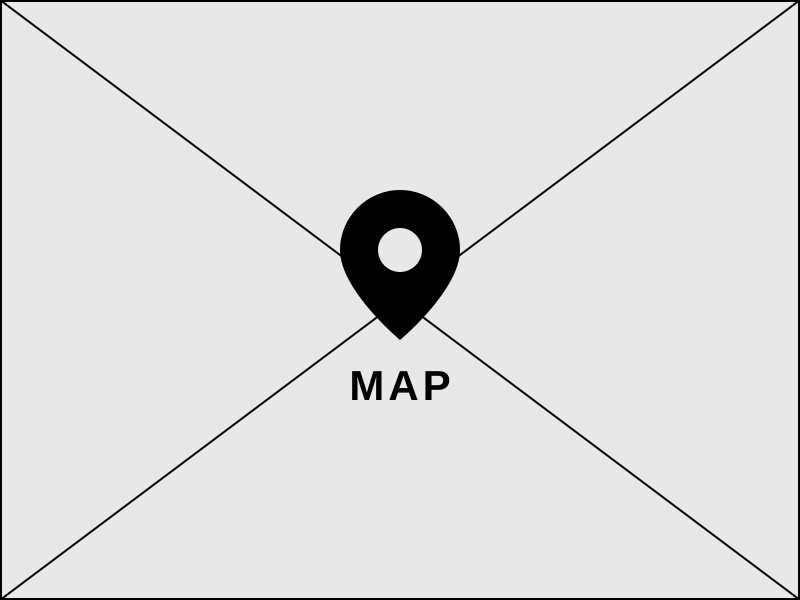

::: grid-2

### Panel
SmartSaver &nbsp;&nbsp;&nbsp; <a href="#grocery-list" class="wmd-button wmd-icon">≡</a> <a href="#settings" class="wmd-button wmd-icon">⚙</a>

**Trip · origin & stops**
[Use my location]{.primary}

[Search a place__________]

- [x] Stop 1
- [x] Stop 2

**Staples & deals**

::: card
Milk — Save $0.60 [-15%]{.chip}
:::

::: card
Eggs — Save $0.90 [-20%]{.chip}
:::

::: card
Bread — Save $0.35 [-10%]{.chip}
:::

- [x] Round trip — include the drive back home

**12.4 km** Distance
**18 min** Est. time
**$1.85** Fuel

[Open in Google Maps]{.primary}

[Apple Maps] [Waze]

### Map & navigator

:::

---

<a href="#home" class="wmd-button wmd-icon">‹</a> Weekly list

[Edit]{.primary}

[Filter items_________________________]

### Produce
- [ ] Bananas [-15%]{.chip}
- [x] Spinach
- [ ] Avocado [-20%]{.chip}

### Dairy & eggs
- [x] Milk
- [ ] Eggs

---

<a href="#home" class="wmd-button wmd-icon">‹</a> Settings

### Vehicle
[Compact]{.primary} [Sedan] [Truck]

### Region fuel price
[Average]{.primary} [Custom]

### Manual overrides
Fuel price ($ CAD)

[____]{type:number value:1.50}

Efficiency (L/100km)

[____]{type:number value:8.0}

### Rewards
::: card
PC Optimum — Real Canadian Superstore [Linked]{.chip}
:::

<a href="./add-reward.render.html" class="wmd-button">+ Add a rewards program</a>
